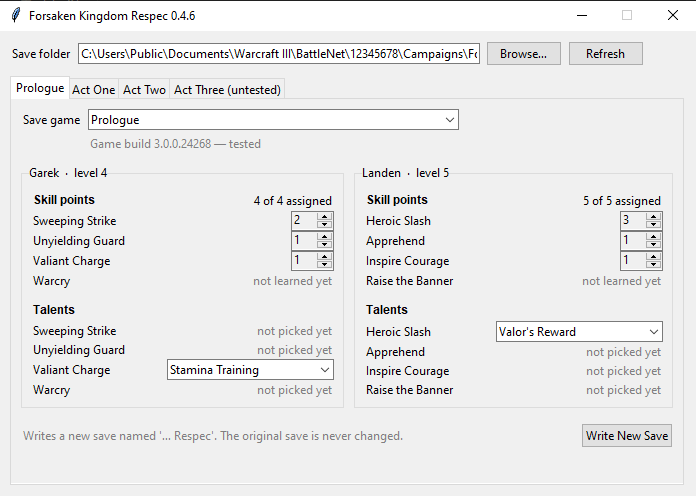

# Forsaken Kingdom Respec

A small Windows tool that changes hero talents and skill points in a
Warcraft III: Reforged *Forsaken Kingdom* save. It exists because the campaign
has no way to undo a talent, and a few talents break the ability they modify.

It never touches your original save. It writes a new one called
`<save name> Respec` next to it, which you load from the campaign's Load Game
screen like any other.

## What it does

- Swap any talent you have already picked for another choice in the same row
  (for example Anya's Wraithguard -> Guiding Light, Garek's The Best Defense
  -> Counter Attack).
- Move skill points between abilities you have already learned, take points back
  off an ability (they return to the hero's pool to spend in game, which is how
  to reach an ability you have not learned), or spend points the hero is holding.
- Hover over any ability or talent to read its in-game description for the
  level and talent currently selected, including the per-level breakdown the
  game shows when you spend a point. The text comes from the save, falling
  back to `fkrespec/tooltips_data.json` for the few abilities no save
  defines.
- Keep to the levels the game allows. Each hero's panel shows their level, and
  an ability stops where their level stops it, exactly as it does in game.
  Hovering an ability names what the next point would cost, for whichever level
  is showing, so stepping through the levels walks the whole ladder: Withering
  Fire wants hero level 1, 5, 9, 13 and 17, Banshee's Wail 6, 12 and 18.



## What it does not do

- Give you more skill or talent points than you earned, or clear a talent row
  back to empty. Removing a talent means removing its object from the save, and
  the game crashes on load when anything still refers to it (FORMAT.md has the
  details). Swap the row to a different choice instead.
- Unlearn an ability completely, or learn one you have not learned. An ability
  you have never spent a point on does not exist in the save at all; the game
  creates it when the point is spent. Lower another ability instead, which hands
  the point back, and spend it in game on whatever you meant to take.
- Learn an ability from nothing. If Banshee's Wail is not learned yet, learn
  it in game first.
- Move points into or out of Attribute Bonus. Every hero's Attribute Bonus is
  the same ability as far as the save is concerned, so the editor can tell you
  how many points are in it but cannot tell one hero's from another's well
  enough to write it. It is shown, and counted in the total, as read only.
- Enforce ability levels in Act Three, which no save has been seen from yet.
  How much hero level each rank after the first costs is the one number the save
  does not carry - it is 2 in the prologue and 4 in the acts, read from the
  game's own tooltips - so in Act Three it is taken from Act Two and treated as
  advice. Abilities go to their full range there, hovering one says the figure
  is unconfirmed, and writing a save that goes past it asks first instead of
  refusing. The tab also warns that an act can add a hero the editor has never
  met, as Act Two did with Leonid.

## Using it

1. Run `FKRespec.exe`. The game can stay open - the new save appears in the
   Load Game list straight away, so you can respec and carry on playing. It
   finds your save folder on its own
   (`Documents\Warcraft III\BattleNet\<id>\Campaigns\ForsakenKingdom`) and
   sorts your saves into tabs by campaign part: Prologue (Garek, Landen,
   Ilastar), then Act One, Two and Three (Anya and Garek, who carry through
   the acts unchanged, plus Leonid once he joins in Act Two).
2. Pick a save. Each hero in it appears with their ability levels and talent
   rows. Change what you want; the skill-point total must stay the same.
   Some talents have no talented version of the ability in the game's data
   (they work through the talent alone); for those the ability keeps its
   base form, which is what the game does too.
3. Click **Write New Save**. Writing runs in the background with a progress
   bar, so the window stays responsive on the larger saves. Load `<name> Respec` in the game.

If a save reads back oddly or the game refuses to load the copy, delete the
copy (and its folder under `Blizzard\`) and nothing is lost.

Tested on game build 3.0.0.24268. The tool warns when a save comes from a
build it has not been tested on; Blizzard can change the save format in any
patch.

## If Windows blocks it

`FKRespec.exe` is not code-signed, so the first time you run it Windows
SmartScreen says "Windows protected your PC". Click **More info**, then **Run
anyway**. That warning is about the file having no signature and no download
history, not about anything it found.

Antivirus software sometimes flags programs packaged this way - a Python
program bundled into one executable looks, to a scanner, a little like
something unpacking itself at startup. Windows Defender with current
definitions reports this one clean. If another scanner disagrees, it is a false
positive, and you have two ways to not take my word for it.

Check the file is the one I published. Every release lists the SHA-256 of the
exe; compare it with:

```
certutil -hashfile FKRespec.exe SHA256
```

Or skip the executable entirely and run the source, which is the same program
without anything to trust: see below. It needs Python and nothing else.

## Running from source

Python 3.8 or newer, no third-party packages.

```
python -m fkrespec                     # the window
python -m fkrespec show "path\to\save.w3z"   # print heroes, talents and levels
```

`tools/selftest.py` checks the editor against your own saves: that repacking an
untouched save reproduces it byte for byte, that a corrupted block is rejected,
that every hero reads back sanely, that an edit reads back as the edit, and that
the edits the tool refuses stay refused. It writes only to a temporary folder.

`build.bat` produces `dist\FKRespec.exe` with PyInstaller.

`tools/memread.py <save folder>` refreshes `fkrespec/tooltips_data.json` from a
running game. It is read-only (it opens the process for reading and scans for
strings) and is only needed when adding heroes or after a patch changes wording.

## How it works

`FORMAT.md` documents the save layout. Short version: a `.w3z` is the replay
container (zlib blocks with a folded-CRC checksum) around a full dump of the
game state. Each hero ability and each picked talent is an object with its
four-character id stored twice and its level once; picking a talent on an
ability row also swaps that ability for a talented variant (`AUwf` ->
`AUw1`). The tool retags those objects, updates the hero's ability list and
the hero's record in the embedded campaign cache, and repacks.

## Adding a hero

`fkrespec/heroes.py` holds each hero's unit type, campaign part, four base
ability ids, the prefix their talented variants use per slot, and the talent
rows (label, three names, and which slot the row modifies, if any). A save
with the new hero in the party is all that is needed: `tools/abildefs.py`
lists ability definitions with names, `tools/livehero.py` finds the hero
block (current and base ability lists), and the talent records carry their
own names and text.

## Credits

Warcraft III: Reforged and the Forsaken Kingdom campaign are made by Blizzard
Entertainment. This tool is unofficial: not affiliated with, endorsed by or
supported by Blizzard. Warcraft and Warcraft III are their trademarks.

Nothing from the game is redistributed here. The tool reads and rewrites save
files the game has already written on your own machine, and the ability and
talent text it shows is read out of your own installation so it can name what
it is editing.

The container format came from the community `.w3g` replay documentation.
Everything inside the container was worked out from saves for this tool.

## License

MIT, see `LICENSE`.
